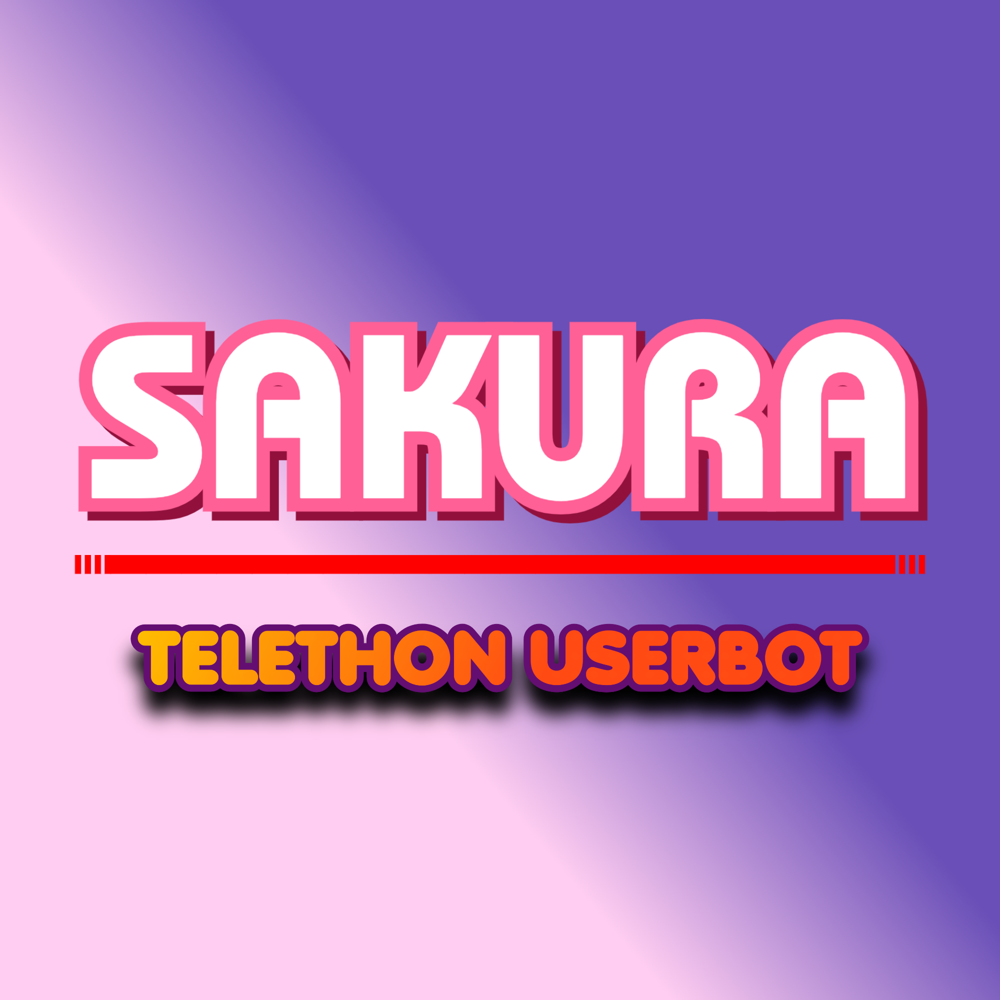

  

<h1 align="center">
  <b>🌸 Sakura - UserBot</b>
</h1>

<b>a stable pluggable telegram userbot + vc music bot, based on telethon.</b>

----

## Deploy to Heroku
Get the [Necessary Variables](#Necessary-Variables) and then click the button below!  

## Session String
Dapatkan `STRING_SESSION` dari repl.it:
* 

----

## Necessary Variables
- `API_ID` - Your API_ID from [my.telegram.org](https://my.telegram.org/)
- `API_HASH` - Your API_HASH from [my.telegram.org](https://my.telegram.org/)
- `SESSION` - SessionString for your accounts login session. Get it from [here](#Session-String)
- `REDIS_URI` - Redis endpoint URL, from [redislabs](http://redislabs.com/), tutorial [here.](./resources/extras/redistut.md)
- `REDIS_PASSWORD ` - Redis endpoint Password, from [redislabs](http://redislabs.com/), tutorial [here.](./resources/extras/redistut.md)

# License
Sakura is licensed under [GNU General Public License](https://www.gnu.org/licenses/gpl-3.0.en.html) v3 or later.

# Credits
* 
* [Lonami](https://github.com/LonamiWebs/) for [Telethon.](https://github.com/LonamiWebs/Telethon)
* [AndrewLaneX](https://github.com/AndrewLaneX) for [tgcalls-base.](http://github.com/tgcallsjs/tgcalls)

Made with 💕 by [@VeezProject](https://t.me/levinachannel).  
